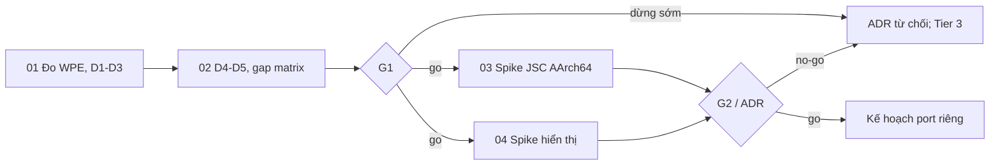

# Kế hoạch Serval — giai đoạn khả thi

## Quyết định
Serval là trình duyệt đầy đủ dùng **WPE WebKit 2.54.x** (WPEPlatform, Skia CPU), chạy trong **Tier 2**. Kế hoạch này chỉ cover giai đoạn khả thi. Chưa port engine, chưa tạo cell `serval`, chưa đổi ABI khi chưa có approval.

Câu hỏi duy nhất của giai đoạn này: **các điều kiện để port WPE có đáp ứng được không, hay phải dừng sớm?** Trả lời theo hai tầng:
1. **Điều kiện dừng sớm (D1–D5)**: kiểm tra trên Linux host và đọc mã Cellos, không sửa core. Chỉ cần **một** điều kiện trượt mà không có lối thoát chấp nhận được thì dừng.
2. **Gap xây được**: những thứ Cellos chưa có nhưng làm được. Chúng không phải lý do dừng, chỉ là chi phí. Hai gap rủi ro nhất được kiểm bằng spike.

**Đã duyệt 2026-10-07:** người dùng chốt hướng “thử WPE trên Linux trước, rồi mới bổ sung các điều kiện để port (font, GPU, thư viện…)”, và chấp nhận các ngưỡng đề xuất:
- D1b: ≥30 fps khi cuộn trang và khi chạy animation `transform` ở 1080p, chế độ chỉ dùng CPU;
- D3: trang 3 và 6 tương tác được trong ≤3 s (quy đổi sang i7-8565U), và điểm Speedometer khi tắt JIT ≥25% điểm khi bật JIT.

## Phần cứng mục tiêu
- **RPi5** (BCM2712, Cortex-A76, AArch64) hoặc **x86 Intel i7-8565U** (Whiskey Lake, 4C/8T). Dùng cho cả Serval lẫn Tier 3. RPi3 bị loại khỏi mục tiêu Serval.
- Hiện trạng repo cho hai máy này. Đây là điều kiện tiên quyết để chạy trên phần cứng thật, **không** phải điều kiện của giai đoạn khả thi (spike chạy QEMU):
  - RPi5: chưa có board descriptor; repo chỉ có `boards/raspberry-pi/3-model-b`, `4-model-b`.
  - x86 PC: chưa qualify máy nào (`docs/hardware-compatibility-list.md:3-4`).
  - Tier 3 trên Intel cần VT-x, mà VT-x **chưa được implement**; x86 Tier 3 hiện chỉ có AMD SVM (`docs/roadmap/hardware-tracks.md:72`, gate X86-PC-6). Tức là với i7-8565U, Tier 3 cũng chưa chạy được.
- Tier 2 trên AArch64 và x86_64 hiện chỉ admit trong image `test-hooks` (`kernel/src/loader/domain_admission.rs:149-170`). Lifecycle grant trên AArch64 chỉ có ở test-hooks, trên x86_64 đóng hẳn (`kernel/src/task/syscall.rs:233-281`). x86_64 không có POSIX shim và C++ ABI (`libs/api/src/services/posix.rs:11-17`; `cells/tests/cpp-smoke/build.rs:77-85`). Mở Tier 2 production trên đúng arch mục tiêu là một gap K.

## Điều kiện dừng sớm
| # | Điều kiện | Vì sao có thể dừng | Kiểm ở |
|---|---|---|---|
| D1 | WPE 2.54 render được ở chế độ headless chỉ bằng CPU, **không cần GPU/EGL/GBM/DMA-BUF** | Cellos không có driver GPU (VideoCore VII, Intel UHD 620) và không có EGL/GLES. Viết driver GPU 3D nằm ngoài tầm. Nếu bắt buộc phải có EGL, lối thoát duy nhất là port Mesa softpipe, khi đó phải định lượng lại. | Phase 01 |
| D1b | Khi chỉ dùng CPU, cuộn trang và animation `transform` đạt ≥30 fps ở 1080p trên i7-8565U (ngưỡng người dùng chốt) | Cellos không có GPU, nên CPU-only là chế độ vĩnh viễn chứ không phải tạm thời. Trượt nghĩa là trải nghiệm không chấp nhận được, kể cả khi port thành công. | Phase 01 (đo GPU so với CPU trên chính i7-8565U) |
| D2 | Build được **tĩnh**, không cần `dlopen` cho chức năng lõi (GIO module TLS của glib-networking, các module khác) | Cellos chỉ có static PIE. ADR-0018 từ chối dynamic linking. | Phase 01 |
| D3 | Với **JIT tắt** (LLInt/CLoop), trang thật vẫn dùng được trên CPU cỡ i7-8565U | Cellos áp W^X và không có `mprotect`. Bật JIT đồng nghĩa với ADR phá W^X. | Phase 01 (so JIT bật/tắt trên host) |
| D4 | GC của JSC chạy được **không cần async signal**, hoặc có một syscall suspend đồng bộ thay thế mà không phá ADR-0018 | Linux JSC dùng SIGUSR1 để dừng thread. | Phase 02 (đọc WTF) |
| D5 | Kernel lưu/khôi phục thanh ghi **FP/SIMD** của task user (NEON trên AArch64, SSE/AVX trên x86_64), hoặc có thể thêm việc này | WebKit/Skia/JSC dùng FP/SIMD dày đặc trên nhiều thread. Grep chỉ thấy lưu Q-register ở đường world-switch vCPU (`hal/arch/arm/src/aarch64/vcpu.rs:566-751`), không thấy `fxsave`/`xsave` hay lưu FP của task. Cell x86 build `x86_64-unknown-none` (soft-float). `[INFERENCE]` phải xác minh bằng cách đọc context switch. | Phase 02 |

D1–D3 trượt và không có lối thoát chấp nhận được → dừng. D4–D5 nhiều khả năng chỉ là gap K, nhưng nếu xác minh ra là phá bất biến thì cũng thành điều kiện dừng.

Hiện tại, theo code và tài liệu: **chưa có điều kiện nào đã được chứng minh đạt**. Chưa thấy điều kiện nào chắc chắn trượt. D1 là rủi ro dừng lớn nhất, vì tài liệu Graphics của WebKit nói đường frame API mới hiện chỉ có DMA-BUF.

## Bối cảnh và đẩy ngược
- ADR-0017 §2.2–§4 và README hiện xếp trình duyệt đầy đủ vào **Tier 3**. ADR-0018 xếp JIT, dynamic linking, `mmap(MAP_SHARED)` và async signal vào Tier 3. Serval trên Tier 2 vì vậy là thay đổi kiến trúc, cần ADR-0022 (Phase 05).
- Ngay cả khi D1–D5 đều qua, Tier 2 vẫn thiếu: VA/heap lớn, `mmap`, PT_TLS, C++20 hosted, đa domain có shm + truyền handle, nạp ELF lớn, đường hiển thị Tier 2, font/text. Chi tiết: [scout-report.md](scout-report.md).

## Giai đoạn
| # | Deliverable | Phụ thuộc | Chạm core? | Effort | Status |
|---|---|---|---|---|---|
| 01 | [Đo WPE trên Linux + kiểm D1–D3](phase-01-wpe-demand-inventory.md) | none | Không | 4–6 ngày | pending |
| 02 | [Kiểm D4–D5, gap matrix, cost model, gate G1](phase-02-gap-matrix-and-g1.md) | 01 | Không (chỉ tài liệu) | 2–3 ngày | pending |
| 03 | [Spike A: sysroot C++ + JSC shell trong Tier 2 (AArch64)](phase-03-spike-jsc-tier2.md) | G1 = go | Có, sau feature flag + approval | 3–6 tuần | pending |
| 04 | [Spike B: hiển thị pixel từ Tier 2](phase-04-spike-tier2-presentation.md) | G1 = go | Có, sau approval | 1–2 tuần | pending |
| 05 | [Gate G2 và ADR Serval](phase-05-g2-decision-adr.md) | 03, 04 (hoặc 02 nếu no-go) | Không | 2–3 ngày | pending |

Có thể biết câu trả lời “phải dừng sớm hay không” **sau Phase 01–02, khoảng 1,5 tuần, không sửa Cellos**. Phase 03–04 chỉ chạy khi G1 = go và làm song song được.

## Arch của spike
Spike chạy trên **AArch64 QEMU `virt` (`-cpu cortex-a76`)**, cùng họ CPU với RPi5. AArch64 đã có POSIX shim, `cpp-freestanding` và lifecycle grant domain ở mức test-hooks. x86_64 thiếu nhiều hơn (không shim, không C++ ABI, grant lifecycle đóng), nên chỉ ghi vào gap matrix. RV64 là backend Tier 2 trưởng thành nhất nhưng không phải phần cứng mục tiêu; chỉ dùng làm fallback nếu AArch64 kẹt vì lỗi hạ tầng không liên quan.

## Ngoài phạm vi
- Port WebCore/WebKit IPC/NetworkProcess, giao diện Serval, media, WebGL/WebGPU, WebRTC, extension.
- Bật JIT: giai đoạn này giữ W^X. Nếu D3 trượt, việc bật JIT được trình bày tại G1 như một phương án cần ADR, không âm thầm thực hiện.
- Bring-up RPi5 và qualify laptop x86; VT-x cho Tier 3. Các việc này có kế hoạch riêng.
- Kết quả QEMU không qualify phần cứng (`docs/hardware-compatibility-list.md:12-15`).

## Tiêu chí kết thúc giai đoạn khả thi
1. `evidence/serval-demand-inventory.md` có số đo tái lập được, và kết luận D1–D3 kèm bằng chứng.
2. `evidence/serval-gap-matrix.md` có kết luận D4–D5, phân loại U/K/A, chi phí S1/S2/S3. Người dùng đã quyết định G1.
3. Nếu G1 = go: spike A cho output khớp golden trên AArch64 Tier 2; spike B có frame từ domain lên compositor và ảnh chụp chứng minh.
4. ADR-0022 ở trạng thái Accepted hoặc Rejected.

## Gate, giả định, rủi ro
- **Law 1:** mọi thay đổi ABI/kernel ở Phase 03–04 cần approval thiết kế trước khi sửa, và approval lần hai sau exact delta + evidence.
- Có session khác đang làm trong core/Tier 3. Phase 01–02 không sửa repo ngoài `.agents/` và `docs/`. Phase 03–04 phải phối hợp owner core.
- License: WebCore/WebKit, glib, libsoup là LGPL. Link tĩnh LGPL vào image phải cho người dùng relink được. Phase 02 lập inventory.
- Footprint không còn là điều kiện dừng: RPi5/i7 có RAM dư cho WPE. Footprint vẫn được đo để ước lượng phần còn lại cho Tier 3 chạy song song.

## Validation / adversarial self-review
Đã đối chiếu: không JIT, không signal, đường frame WPE gắn với DMA-BUF, chỉ có static link, slot VA 32 MiB, cell-store 32 MiB, mixed grant bị chặn, Tier 2 AArch64/x86 chỉ có ở test-hooks, VT-x chưa có, RPi5 chưa có board, không thấy lưu FP/SIMD của task, ADR-0017/0018 mâu thuẫn. Đây là self-review, không phải independent approval.

## Handoff
`$hc-cook /home/dmin/cellos/.agents/261007-1904-serval-wpe-feasibility/plan.md`
Bắt đầu Phase 01: chỉ đo trên Linux host, không sửa core.
