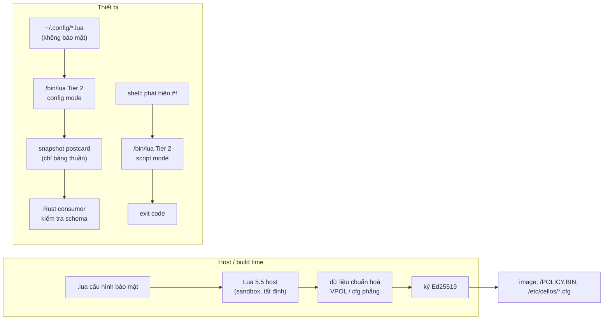

# Research: Lua chạy ở Tier 2 làm môi trường scripting và cấu hình cho Cellos

- Ngày: 2026-10-09 · Độ sâu: `--deep` · Loại: `arch`
- Phạm vi: (a) Lua làm ngôn ngữ cấu hình, chuyên nghiệp hơn file phẳng; (b) script chạy ngay như Python/PHP/JS; (c) LuaJIT khi cần tốc độ.
- Nguồn trong repo được trích `file:line`. Nguồn ngoài có link. Điều chưa quan sát trực tiếp được đánh dấu `[INFERENCE]`.

---

## Verdict

1. **(a) Cấu hình bằng Lua: khả thi** với điều kiện Lua chỉ được dùng để *sinh ra dữ liệu*. Phía nhận cấu hình (consumer) không bao giờ chạy Lua; nó chỉ nhận một snapshot dữ liệu đã được Rust kiểm tra schema. Riêng cấu hình bảo mật (`/POLICY.BIN`, manifest, `cluster.key`) phải giữ dạng khai báo và có chữ ký. Ở lớp này Lua tối đa chỉ được làm ngôn ngữ soạn thảo trên host, chạy lúc build.
2. **(b) Script chạy ngay: khả thi.** Nền đã có sẵn: REPL, `-e`, chạy file từ VFS, `require`, `vfs.*`, `vnet.*`. Phần còn thiếu là lớp "CLI runtime": shebang, `arg`, `os.exit`/exit code, `os.time`, stdin, đường dẫn module, giới hạn tài nguyên, và một bản build có trong CI. Chuyển Lua sang Tier 2 còn giải quyết luôn vấn đề "park thay vì exit".
3. **(c) LuaJIT JIT: KHÔNG khả thi hiện tại.** Có ba blocker độc lập, mỗi cái đủ để chặn một mình:
   - Kernel từ chối mọi mapping W+X ở Tier 2 và không có syscall cấp bộ nhớ thực thi hay đổi quyền trang.
   - LuaJIT upstream chưa hỗ trợ RISC-V 64, trong khi RV64 là kiến trúc duy nhất đã được admit Tier 2 production.
   - ADR-0018 loại JIT khỏi runtime profile.

   Hướng tốc độ nên đi: Lua 5.5 → native module viết bằng Rust → (tùy chọn) AOT. LuaJIT chỉ đáng xem lại khi cả ba blocker được gỡ.
4. **Điều chỉnh tiền đề:** Cellos **không có cấu hình TOML lúc runtime**. Không có parser TOML và cũng không có file `.toml` nào được nạp khi chạy. Cấu hình hiện tại gồm KV trong RAM, file `key=value` phẳng, bảng Rust biên dịch sẵn và blob VPOL đã ký (chi tiết bên dưới). Vì vậy đây là việc *thêm một lớp cấu hình*, không phải "thay TOML".
5. **Rào cản quản trị:** từ 2026-10-08, "standalone scripting" đang ở trạng thái parked. Việc mới phải có consumer C2C được đặt tên (`docs/roadmap/runtime-and-platform-tracks.md:3-9`). Muốn mở lại hướng này cần một ADR và một consumer C2C cụ thể.

---

## Hiện trạng (bằng chứng)

### Lua runtime
| Mặt | Thực tế | Nguồn |
|---|---|---|
| Phiên bản | PUC-Rio Lua **5.4.7**, vendored, build qua `cc` | `cells/runtimes/lua/src/c/src/lua.h:18-25`, `cells/runtimes/lua/build.rs:39-78` |
| Chế độ chạy | REPL / `-e` / đường dẫn file VFS | `cells/runtimes/lua/src/main.rs:265-331` |
| Kết thúc | `-e` và chạy file đều **park bằng `yield_now()` vĩnh viễn** vì cell SAS khi exit không được unmap | `main.rs:271-277,316-318` |
| Stdlib | `liolib.c`/`loslib.c` bị loại; `io`/`os` là bảng rỗng; prelude thêm `io.write`/`io.open` dựa trên VFS và xoá `io.popen`, `os.execute`, `debug`, `package.loadlib` | `build.rs:62-68`, `glue/lua_stdlib_stubs.c:22-31`, `main.rs:95-120` |
| `os` | Không có `os.exit`, `os.time`, `os.date`, `os.getenv` | `glue/lua_stdlib_stubs.c:26-30` |
| Module | `package.path='/tmp/?.lua'`; searcher tự viết đọc qua VFS; không có `?/init.lua`, không có root hệ thống | `main.rs:107-118` |
| Tham số | Có `ostd::args()` nhưng **không có bảng `arg`/`...`**; argv tối đa 512 byte | `main.rs:191`, `cells/tools/shell/src/executor.rs:880-907` |
| Shebang | Không có dispatch `#!` trong shell, loader hay kernel. Ngoài ra `luaL_loadbufferx` **không bỏ qua dòng `#`**; chỉ `luaL_loadfilex` làm việc đó | `executor.rs:859-907`; `src/c/src/lauxlib.c:771-809` |
| Bytecode | Mode `NULL` nên nhận cả chunk nhị phân | `main.rs:297-303` |
| Bộ nhớ | `malloc` → `__wrap__sbrk` trên arena BSS tĩnh **8 MiB**; không dùng `lua_setallocf`, `lua_sethook` hay giới hạn CPU | `glue/lua_vios_glue.c:37-75`, `build.rs:244-266` |
| API Cellos | `vfs.{read,write,append,mkdir,stat,listdir,remove}`; `vnet.{connect,send,recv,close,udp_*,resolve}` | `main.rs:210-252` |
| Manifest | `block_io/network/spawn=false`, lớp `TIER_LEGACY`: ký hợp lệ → SAS; không ký → domain | `main.rs:10`, `kernel/src/loader/governed_spawn.rs:59-93` |
| Build/CI | CI **loại lua** (`--exclude doom,lua,tetris-lua`). Trên Linux, cell link với picolibc/newlib không build được | `scripts/gen-disk-ci.sh:45-49,79-81` |
| Test | Không có test integration Lua; chỉ có unit test VFS và `scripts/qemu-lua-vnet.py` chạy tay | `bindings_vfs_handle_read_tests.rs`, `scripts/qemu-lua-vnet.py` |

**Docs lệch so với code:**
- `docs/guides/tier1b-lua.md:42,129-142` quảng cáo `os.time`/`os.exit`, shebang và `{...}` args, nhưng code không có.
- `docs/scripting-guide.md:183-195` nói `require` là stub, nhưng code đã có searcher.
- Spec 18 xếp Lua vào Tier 2 (`docs/specs/18-cell-trust-tiers.md:52,58-60`), trong khi Spec 23 ghi Lua là "trusted Tier-1, Tier 2 UNSUPPORTED" (`docs/specs/23-native-sdk-contract.md:180,240-246`).

### Cấu hình hiện tại
| Loại | Định dạng / nơi parse | Nguồn |
|---|---|---|
| Config service `/bin/config` | `BTreeMap<String,String>` trong RAM, IPC postcard `Get/Set/Delete/List`, không lưu xuống đĩa; chỉ vào image khi bật feature `ai` | `cells/services/config/src/main.rs:27-119`, `libs/api/src/services/ipc.rs:563-613`, `cells/tools/init/src/service_table.rs:78-97` |
| Danh sách service khởi động | Bảng Rust biên dịch sẵn `service_table::configured()` | `cells/tools/init/src/service_table.rs:45-148` |
| C2C | `/etc/cellos/cluster.cfg`, `/etc/cellos/c2c-exports.cfg`: `key=value` phẳng, ≤4 KiB, đọc một lần lúc start, fail-closed | `cells/services/net-broker/src/identity.rs:57-89`, `peer_config.rs:1-104`, `export_registry/source.rs:5-35` |
| Chính sách bảo mật | `/POLICY.BIN` (VPOL v1–4): kernel verify Ed25519 **trước khi** parse; nguồn là list Python trong `scripts/sign-policy.py` | `kernel/src/policy.rs:1-19,159-205`, `scripts/sign-policy.py:68-236` |
| TOML runtime | **Không tồn tại** (không có dependency, không có parser) | ConfigSystemScout: tìm dependency/parse trên `cells kernel libs tools scripts` không ra kết quả |

### Tier 2 và bộ nhớ thực thi
| Mặt | Thực tế | Nguồn |
|---|---|---|
| W+X | Mọi mapping user của private root có cả WRITE và EXECUTE đều bị từ chối | `kernel/src/memory/address_space.rs:1392-1394` |
| Bộ nhớ runtime | `ShmMap` = RW; grant = RW+NX; không có `mmap`/`mprotect`/syscall cấp vùng thực thi | `kernel/src/task/syscall.rs:367-400,5230-5265`, `libs/api/src/abi/syscall.rs:221-223,312-333` |
| icache | Chỉ có helper trong kernel (AArch64 `dc cvau`/`ic ivau`) dùng cho loader; không có đường cho user | `hal/arch/arm/src/aarch64/cache.rs:1-54`, `kernel/src/loader/wx.rs:148-166` |
| Kiến trúc | Production Tier 2: **chỉ RV64**. AArch64/x86_64 chỉ chạy trên image `test-hooks`, có const-assert chặn | `kernel/src/loader/domain_admission.rs:149-170` |
| Hướng chương trình | Intel x86-64 C2C là chương trình duy nhất; x86 Tier 2 mới ở mức test-image | `docs/decisions/0022-intel-x86-64-c2c-only-direction.md:19-22,109-111` |
| Chính sách runtime | Điều kiện 5: "Does not depend on dynamic loading, JIT…"; ứng dụng có JIT thuộc lane L3 (Tier 3) | `docs/decisions/0018-cell-native-portability-and-runtime-profiles.md:77,89` |
| Quota | Heap 16 MiB/cell, stride VA 32 MiB, stack 256 KiB; `GrantAlloc` ≤16 MiB mỗi lần gọi | `ADR-0018:88`, `kernel/src/memory/cell_quota.rs:26-35`, `syscall.rs:164-166` |
| Thoát sạch | Domain teardown trả frame; cell Tier 2 `exit(42)` chạy được | `docs/evidence/c-spawn-harts1-qemu.txt:465,487`, `docs/evidence/atomic-publication-ledger-x86-settling.txt:75-76` |
| Script là dữ liệu | Admission/chữ ký chỉ áp lên byte ELF; file `.lua` không có khái niệm admission | `kernel/src/loader/governed_spawn.rs:44-93`, `domain_admission.rs:93-100` |

---

## When to use

- **Cấu hình người dùng/ứng dụng không liên quan bảo mật.** Ví dụ: shell profile, keymap, theme ViUI, tham số ứng dụng, kịch bản test. Ở đây cần biến, hàm, `include`, giá trị tính toán và kiểm tra hợp lệ, những thứ file phẳng `key=value` không làm được.
- **Soạn thảo cấu hình trên host lúc build.** Lua sinh ra `cluster.cfg` / `c2c-exports.cfg` / bảng VPOL rồi đóng băng thành dữ liệu và ký. Lua không chạy trên thiết bị.
- **Script tự động hoá và vận hành.** Ví dụ: probe mạng (`vnet`), thao tác file (`vfs`), smoke test C2C. Đây là hướng có thể gắn được với một consumer C2C.

## When NOT to use

- **Không dùng làm nguồn chính sách lúc runtime.** `/POLICY.BIN`, manifest và khoá phải được verify trước khi parse (`kernel/src/policy.rs:159-205`). Một interpreter Turing-complete trên thiết bị sẽ phá vỡ chuỗi xác minh đó.
- **Không cho config chạy sớm trong boot** khi Lua cell còn bị loại khỏi CI (`gen-disk-ci.sh:45-49`) và vẫn đang park thay vì exit.
- **Không coi Lua ở Tier 1 là ranh giới bảo vệ.** C chạy chung SAS. Bản thân Spec 23 cũng ghi "Lua is not containment" (`docs/specs/23-native-sdk-contract.md:180`).
- **Không dùng LuaJIT** trước khi có ABI JIT, có RISC-V upstream, và ADR-0018 được sửa.

---

## Trade-offs

### Ma trận engine
| Engine | RV64 (Tier 2 prod) | x86_64 / AArch64 | Cần bộ nhớ thực thi | Ngữ nghĩa | Sandbox | Công sức |
|---|---|---|---|---|---|---|
| PUC Lua 5.4.7 (hiện tại) | Có | Cần cross-compiler; không có thì chỉ là stub | Không | 5.4 | Tự làm | 0 |
| **PUC Lua 5.5.1** | Có | Như trên | Không | 5.5, có `global`; một số điểm không tương thích | `luaL_openselectedlibs` | Thấp |
| LuaJIT 2.1 (JIT) | **Không** (RISC-V "TBA") | Có | **Có**: mmap đặt gần, RW↔RX, flush icache | 5.1 + một phần 5.2 | FFI phá sandbox | Rất cao + kernel |
| LuaJIT 2.1 `LUAJIT_DISABLE_JIT` | **Không** (interpreter viết asm cho từng kiến trúc) | Có | Không (`lj_mcode.c` nằm trong `#if LJ_HASJIT`) | 5.1 | Như trên | Cao; tách dialect |
| Luau | Interpreter là C++ portable `[INFERENCE]`; JIT chỉ x64/arm64 | Có | Chỉ khi bật JIT | Lua 5.1 + kiểu | Tốt nhất (đã thiết kế sẵn) | Cao: C++ chưa có profile (ADR-0018 §2.3) |
| Pallene (AOT → C) | Về lý thuyết có | Có | Không | Tập con có kiểu | Không áp dụng | Cao; cần Lua đã vá, output dạng `.so` |
| Starlark / Pkl / CUE | Không có bản `no_std` sẵn `[INFERENCE]` | — | Không | DSL cấu hình | Hermetic | Cao; thêm một ngôn ngữ thứ hai |

Nguồn: [LuaJIT status](https://luajit.org/status.html) ghi RISC-V 64 "RVA22+ (TBA)". `lj_mcode.c` (LuaJIT v2.1) dừng với `#error "Missing OS support for explicit placement of executable memory"` nếu OS không có cơ chế này. [Lua 5.5 readme](https://www.lua.org/manual/5.5/readme.html). [Luau sandbox](https://luau.org/sandbox/). [Pallene](https://github.com/pallene-lang/pallene) (commit gần nhất 2026-09-30).

### Hiệu năng (giây, Intel N100, càng thấp càng tốt)
| Benchmark | Lua 5.4.6 | Lua 5.5.0 | LuaJIT 2.1 |
|---|---:|---:|---:|
| brainfuck (VM loop) | 1.56 | 1.56 | 0.25 |
| oop-dots (metatable) | 1.36 | 1.42 | 0.09 |
| json (string/hash) | 2.42 | 2.31 | 0.91 |
| coro (50k coroutine) | 1.22 | 1.09 | 0.55 |
| n-body (float) | 1.74 | 1.56 | 0.12 |
| k-nucleotide | 2.72 | 2.75 | 0.70 |
| regex-dna | 2.50 | 2.53 | 2.44 |

Nguồn: [Jipok/Lua-Benchmarks results.dat](https://github.com/Jipok/Lua-Benchmarks). Đây là kết quả trên x86 có JIT, không phải RV64/Cellos. Theo bảng này, với workload dạng cấu hình/IO/chuỗi (json, regex) lợi ích của JIT chỉ khoảng 1×–2.7×. Mức ×10–15 chỉ xuất hiện ở vòng lặp số học hoặc OOP nóng.

### Kiểm chứng ba claim quan trọng
| Claim | Tag | Căn cứ |
|---|---|---|
| JIT không thể chạy trong Tier 2 hiện tại | **VERIFIED** | `address_space.rs:1392-1394`; không có syscall exec/mprotect; `ADR-0018:89` |
| LuaJIT upstream không có RISC-V 64 | **VERIFIED** | [luajit.org/status](https://luajit.org/status.html) ghi "(TBA)". [plctlab/LuaJIT](https://github.com/plctlab/LuaJIT) có port nhưng là fork ngoài upstream |
| "LuaJIT nhanh hơn ~7×" | **CONTESTED** | [arXiv 2601.16670](https://arxiv.org/abs/2601.16670) báo ~7×, nhưng dữ liệu Jipok dao động từ 1.02× (regex-dna) đến >100× (ray). Mức "~2× khi chỉ chạy interpreter" là **UNVERIFIED**: nguồn duy nhất là một bình luận HN |

---

## Implementation Notes (kiến trúc đề xuất)

### A. Config mode, mặc định chặt
- `luaL_loadbufferx(..., mode="t")`: không nhận bytecode, vì bytecode không được Lua kiểm tra hợp lệ.
- Mỗi file chạy với một `_ENV` riêng chỉ chứa `string`, `table`, `math` (bỏ `math.random`), `utf8` và `include(path)` có giới hạn root. Không có `vfs`, `vnet`, `load` hay `collectgarbage`.
- Globals chặt: dùng khai báo `global` của Lua 5.5, hoặc metatable `__newindex` báo lỗi. Mục đích là bắt lỗi gõ sai key.
- Ngân sách tài nguyên: `lua_sethook(LUA_MASKCOUNT)` giới hạn số lệnh, và `lua_setallocf` đặt trần bộ nhớ (ví dụ 1 MiB). Hiện cả hai đều chưa có (`main.rs`).
- Output chỉ gồm nil/bool/number/string/bảng lồng; không có function hay userdata. Output được serialize thành postcard. Consumer Rust validate theo schema rồi mới áp dụng. Lỗi cấu hình thì fail-closed và giữ cấu hình cũ.
- Tất định: không có thời gian, không có số ngẫu nhiên, không có I/O ngoài `include`. Cùng input phải cho cùng snapshot, nhờ vậy có thể hash và ký snapshot.

### B. Script mode (Python/PHP/JS-like)
Các hạng mục, theo thứ tự phụ thuộc:
1. **CI build trước tiên.** Gỡ `--exclude lua` bằng cách thống nhất toolchain RV64 trên Linux (`gen-disk-ci.sh:45-49`). Chưa xong việc này thì không đưa ra claim sản phẩm nào.
2. **Chuyển sang Tier 2.** Đổi manifest sang `PROTECTION_CLASS_UNTRUSTED` theo mẫu `cells/services/ocel-js/src/main.rs:21-32`. Rà soát các syscall Lua đang dùng (`Send/Recv/VfsMutate/...`) theo yêu cầu copy-from-user của Spec 22 (`docs/specs/22-native-domain-cell-implementation-gate.md:115-129`). Thay vòng park bằng `Exit` thật. Đây là lợi ích riêng của Tier 2, có bằng chứng teardown trong `docs/evidence/`.
3. **Shebang.** Shell đọc 2 byte đầu; nếu là `#!` thì spawn interpreter với `[script, args...]`. Lua host bỏ qua dòng đầu bắt đầu bằng `#` trước khi gọi `luaL_loadbufferx`, giống `skipcomment` ở `lauxlib.c:771`.
4. **CLI semantics.** Bảng `arg` và `...`; `os.exit(code)`; `os.time/clock/date` dựa trên syscall `GetTime` đã khai báo (`main.rs:17`); `os.getenv` qua config service; `os.remove/rename` qua `vfs`; `io.read/io.lines` từ stdin.
5. **Module.** `package.path='./?.lua;/lib/lua/?.lua;/lib/lua/?/init.lua'`. Bỏ cơ chế cài bundle vào `/tmp`.
6. **Bộ nhớ.** Viết allocator Lua chạy trên arena lấy từ `GrantAlloc` (RW+NX, ≤16 MiB) thay cho BSS tĩnh 8 MiB, và đặt trần cho từng state.
7. **Đóng gói (lua-pack).** Trên host: `luac` → bytecode + VM → một ELF cho mỗi ứng dụng, có ký. Admission và chữ ký khi đó áp lên ELF, lấp đúng khoảng trống "script là dữ liệu" (`governed_spawn.rs:44-93`), và khởi động nhanh hơn vì không phải parse.
8. **Lua 5.5.1.** Lua 5.4 đã EOL: "There will be no further releases of Lua 5.4" (5.4.9, 2026-08-25; [lua.org/versions](https://www.lua.org/versions.html)). Lợi ích: GC major incremental, mảng lớn tốn ít bộ nhớ hơn khoảng 60%, `global` dùng cho globals chặt.
9. **Sửa docs lệch.** Gồm `tier1b-lua.md`, `scripting-guide.md` và mâu thuẫn Spec 18 ↔ Spec 23.

### C. Tốc độ ("biên dịch khi cần")
| Bậc | Cách làm | Điều kiện |
|---|---|---|
| 0 | Lua 5.5 | Gần như miễn phí; nhanh hơn ~10% ở ray/n-body/coro theo bảng trên |
| 1 | Native module bằng Rust qua `lua_pushcclosure` (cùng mẫu với `vfs`/`vnet`), link tĩnh | Đã có tiền lệ trong repo; không chạm kernel |
| 2 | AOT bằng **Pallene** (tập con có kiểu → C → link tĩnh qua `luaL_requiref`/preload) | Cần Lua đã vá theo yêu cầu của Pallene; phải chuyển mô hình `.so` sang link tĩnh vì Cellos không có dynamic linking (`ADR-0018:31-33`) |
| 3 | LuaJIT | Xem điều kiện mở lại bên dưới |

**Điều kiện để mở lại LuaJIT (cần đủ cả 4):**
1. ABI JIT trong kernel, gắn với một capability riêng, chỉ dùng ở Tier 2. Có hai cách:
   - Dual-mapping: alias RW và alias RX trỏ cùng frame ở hai VA khác nhau. Validator từng mapping không đủ phát hiện trường hợp này, nhưng giữ đồng thời hai alias như vậy vẫn cho phép sửa mã đang thực thi. Không coi đây là cách đáp ứng W^X; phải có cơ chế loại trừ ghi/thực thi trên cùng backing frame.
   - Chuyển RW→RX kèm TLB shootdown.

   Cả hai đều cần thêm syscall đồng bộ icache. Trên RISC-V, `fence.i` chỉ có hiệu lực trên hart cục bộ, nên kernel phải xử lý khi task bị migrate ([Linux CMODX](https://www.kernel.org/doc/html/v6.16/arch/riscv/cmodx.html)).
2. LuaJIT RISC-V lên upstream (yêu cầu RVA22+), **hoặc** x86_64/AArch64 Tier 2 được qualify production (`domain_admission.rs:149-170`).
3. Sửa điều kiện 5 của ADR-0018.
4. Chấp nhận hai dialect: Lua 5.1 của LuaJIT và Lua 5.4/5.5 (khác nhau ở integer, toán tử bitwise, `//`, `<const>/<close>`, `utf8`).

---

## Alternatives

- **Giữ file phẳng + sinh bằng Lua trên host:** rủi ro thấp nhất, gắn trực tiếp với C2C (`cluster.cfg`, `c2c-exports.cfg`). Thiết bị không cần interpreter.
- **Luau:** sandbox tốt nhất trên thị trường ([luau.org/sandbox](https://luau.org/sandbox/)), nhưng là C++ trong khi profile `cpp-freestanding` chưa tồn tại (`ADR-0018:91-95`). Ngữ nghĩa là 5.1 + kiểu, nên lại tách dialect với Lua hiện có.
- **Starlark/Pkl/CUE:** tốt cho cấu hình thuần (hermetic, có kiểu), nhưng không làm được script chạy ngay. Thêm một ngôn ngữ thứ hai; không có bản `no_std` sẵn `[INFERENCE]`.
- **wasmi:** ecosystem.md xếp hạng 2 cho multi-tenant (`docs/research/ecosystem.md:477-479`). Đây là sandbox khác, không phải ngôn ngữ cấu hình.

## Unresolved Questions

1. Đã làm rõ: user muốn so sánh config cứng với config text khai báo và config Lua do user viết; không phải thay một hệ thống TOML hiện hữu.
2. Consumer C2C nào sẽ đứng tên để mở lại track scripting (`runtime-and-platform-tracks.md:7-9`)?
3. Kiến trúc ưu tiên là gì? Chương trình đang tập trung vào x86_64 (ADR-0022), nơi Tier 2 mới ở mức test-image. RV64 thì đã có Tier 2 production nhưng không có LuaJIT.
4. Cấu hình Lua có được phép ảnh hưởng tới service nào khởi động không? Hiện việc đó do bảng compile-time của init quyết định (`service_table.rs:45-148`).
5. Chưa đo được hiệu năng Lua trên Cellos/RV64 (QEMU hoặc board). Mọi số liệu ở trên đều là của x86/Linux.

## Bổ sung: config cứng, config text và Lua

- Khuyến nghị: cấu hình text khai báo làm mặc định; Lua tùy chọn sinh cùng cấu trúc dữ liệu đã kiểm tra schema. Lua mạnh hơn về biểu đạt, không mặc nhiên tốt hơn về tài nguyên, boot hay vận hành.
- NGINX vẫn dùng `nginx.conf`; module Lua bổ sung lập trình trong mô hình xử lý sự kiện, không thay thế toàn bộ định dạng cấu hình. Nguồn: https://docs.nginx.com/nginx/admin-guide/dynamic-modules/lua/index.md .
- TOML là ứng viên khả thi: `toml` 0.9 đã hỗ trợ `no_std`; còn phải xác minh dependency features, giới hạn bộ nhớ và build trên Cellos. Điều này sửa nhận định dè dặt về khả năng dùng TOML trong phần thảo luận trước. Nguồn maintainer: https://epage.github.io/blog/2025/07/toml-09/ .
- Config Lua chỉ sinh snapshot; hook Lua chạy lúc runtime là chương trình và phải có lifecycle/capabilities riêng. Hai chế độ không dùng chung quyền mặc định.
- Reload không phải thuộc tính của đuôi file: cần validate, chuẩn bị, công bố generation và quản lý tác dụng phụ. Một snapshot nguyên tử không đảm bảo cập nhật nhiều service nguyên tử.
